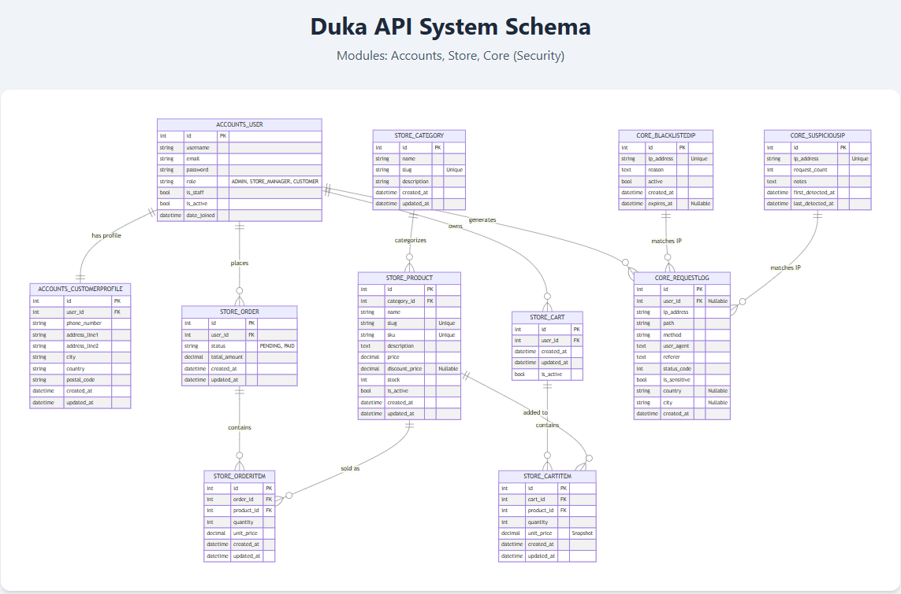

# alx-project-nexus

## **DUKA — E-Commerce Backend API**
A scalable, production-ready **Django + DRF + PostgreSQL** backend powering an e-commerce product catalog, user authentication, cart, and order system.

# **Big Picture**
Duka is an online store backend that manages:

### Users
- **Admin** – Superuser, full access  
- **Store Manager** – Can manage products/categories  
- **Customer** – Can browse, search, add to cart, checkout  

### Product Catalog
- Categories  
- Products  
- Filtering, sorting, pagination  
- Slug-based product detail endpoints  

### Cart & Checkout
- Add/remove/update cart items  
- Validate stock before checkout  
- Convert cart → order  
- Deduct stock automatically 

### Admin Security dashboard
 - which countries are generating traffic  
 - which IPs send the most requests  
 - how many IPs are blacklisted or suspicious  
# ER Diagram
Main entities (models):

- accounts.User
- accounts.CustomerProfile
- store.Category
- store.Product
- store.cart
- store.CartItem
- store.Order
- store.OrderItem
- core.RequestLog
- core.BlacklistedIP
- core.SuspiciusIP

Key relationships:
- User – CustomerProfile:
    User (1) ─── (1) CustomerProfile (one-to-one; only customers use it)
- User – CartItem:
    User (1) ─── (*) CartItem (each user can have many cart items)

- User – Order:
    User (1) ─── (*) Order (each user can place many orders)
- Category – Product:
    Category (1) ─── (*) Product
- Product – CartItem:
    Product (1) ─── (*) CartItem
- Order – OrderItem:
    Order (1) ─── (*) OrderItem
- Product – OrderItem:
    Product (1) ─── (*) OrderItem



| Legend                                        |
|----------|------------|
| PK | Primary Key (Unique Identifier)          |
| FK |Foreign Key (Reference to another table)  |
| ||--|| | One-to-One Relationship              |
| ||--o{ | One-to-Many Relationship             |

# **Technology Stack**
| Component | Technology |
|----------|------------|
| Backend Framework | Django 5 + Django REST Framework |
| Database | PostgreSQL |
| Auth | JWT (SimpleJWT) |
| API Docs | drf-spectacular (OpenAPI/Swagger) |
| Dev Tools | Miro, Postman, Django Admin |
| Seed Data | Custom management command |
| Deployment|                               |

---
---

# **Roles & Permissions**

| Role | Permissions |
|------|-------------|
| **Admin (Superuser)** | Full access (Django admin + API) |
| **Store Manager** | CRUD categories/products |
| **Customer** | View products, manage cart, checkout |
| Guest/Anonymous | Read-only product access |

The API enforces permissions using custom DRF permission classes.

---

# **Project Structure**

```
duka_app/
│
├── accounts/
│   ├── models.py
│   ├── serializers.py
│   ├── views.py
│   ├── signals.py
│   ├── apps.py
│   ├── urls.py
│   ├── admin.py
├── core/
│   ├── models.py
│   ├── serializers.py
│   ├── views.py
│   ├── signals.py
│   ├── apps.py
│   ├── urls.py
│   ├── admin.py
│   ├── middleware.py
│   ├── utils.py
│   ├── ipinfo_backend.py
│   ├── management/
│       └── commands/
│           └── seed.py
│           └── cleanup_logs.py
│           └── seed_core.py
│           └── analyze_logs.py
│
├── store/
│   ├── models.py
│   ├── serializers.py
│   ├── views.py
│   ├── permissions.py
│   ├── urls.py
│   ├── tasks.py
│   ├── management/
│       └── commands/
│           └── seed.py
│           └── heartbeat.py
│           └── low_stock_alert.py
│           └── order_reminders.py
│
├── duka_app/
│   ├── settings.py
│   ├── urls.py
│   ├── celery.py
│   ├── urls.py
│
├── manage.py
├── requirements.txt
├── ER.html
└── README.md
```
# **API Endpoints Overview**

## Authentication
| Method | Endpoint |
|--------|----------|
| POST | `/api/auth/register/` |
| POST | `/api/auth/token/` |
| POST | `/api/auth/token/refresh/` |

---

## Categories
| Method | Endpoint |
|--------|----------|
| GET | `/api/categories/` |
| POST | `/api/categories/` |
| GET | `/api/categories/{id}/` |
| PUT/PATCH/DELETE | `/api/categories/{id}/` |

---

## Products
| Method | Endpoint |
|--------|----------|
| GET | `/api/products/` |
| GET | `/api/products/{slug}/` |
| POST | `/api/products/` |
| PUT/PATCH/DELETE | `/api/products/{slug}/` |

Filters:
```
/api/products/?category=3
/api/products/?ordering=price
/api/products/?search=Electronics
```

---

## Cart
| Method | Endpoint |
|--------|----------|
| GET | `/api/cart/` |
| POST | `/api/cart/` |
| GET | `/api/cart/{id}/` |
| PATCH | `/api/cart/{id}/` |
| DELETE | `/api/cart/{id}/` |

---

## Checkout
| Method | Endpoint |
|--------|----------|
| POST | `/api/checkout/` |

---
## Flow of the API
### Customer Flow (logged-in shopper)

Think: a normal buyer using the store from sign-up → checkout.

1. Get an account & log in

Register

`POST /api/register/ (or /api/auth/register/)`
Body: UserRegistration (username, email, password)
**Creates a new user account.**

Login
`POST /api/auth/token/`
Body: { "username", "password" }
Response: { "access", "refresh" } JWTs
**Customer uses access token in Authorization: Bearer <token> to access everything else.**

Refresh token

`POST /api/auth/token/refresh/`
Body: { "refresh": "<refresh-token>" }
Response: { "access": "<new-access-token>" }
**Keeps the user logged in without re-entering credentials.**

2. Set up their profile / shipping info

Profile (two equivalent endpoints)

`GET /api/profile/ or GET /api/auth/profile/`
**Get current customer profile (phone, address, city, country, postal code).**

`PUT /api/profile/ or PUT /api/auth/profile/`
Body: CustomerProfile
**Save shipping/billing details.**

`PATCH /api/profile/ or PATCH /api/auth/profile/`
**Partial update of profile.**

3. Browse catalogue (categories & products)

Note: Listing products/categories is behind jwtAuth, so the customer must be logged in.

Categories

`GET /api/categories/`
Query: search, ordering, page
**List product categories (paginated).**

`GET /api/categories/{id}/`
**View a single category’s details.**

Products

`GET /api/products/`
Query: search, ordering, page
**List available products.**

`GET /api/products/{slug}/`
**View details of one product (name, price, discount_price, stock, category, etc.).**

4. Manage cart

Cart collection

`GET /api/cart/`
**List all items currently in the customer’s cart.**

`POST /api/cart/`
Body: CartItem with product_id and quantity
**Add a product to cart or update an existing item’s quantity.**

Single cart item

`GET /api/cart/{id}/`
**Inspect a single cart item.**

`PATCH /api/cart/{id}/`
**Change quantity (e.g., 1 → 3).**

`DELETE /api/cart/{id}/`
**Remove item from cart.**

5. Checkout / place order

Checkout

`POST /api/checkout/`
Description: “Convert the current user's cart into an order.”
Body: optionally Order data (status, total_amount – but items are read-only).
Response: Order with:

    - id

    - status

    - total_amount

items[] (each an OrderItem with product, quantity, price_at_purchase)

**This is the “place order” step: everything in the cart becomes a persisted order, prices are locked in.**

## Store Manager Flow (staff/admin user)

Now a store manager logged into some admin UI that calls this API.

They still use the same auth flow, but their user in Django has staff/manager permissions, so they can do write operations on catalogue and security endpoints.

1. Authenticate as manager

Same as customer:

`POST /api/auth/token/ → get access / refresh`

Use Authorization: Bearer <access> for all manager actions.

(Django permission logic decides who can create/update/delete.)

2. Manage categories

List + search

`GET /api/categories/`
**See all categories, maybe to pick one to edit.**

Create

`POST /api/categories/`
Body: Category (e.g. name, slug, description)
**Add a new category like “Electronics”, “Groceries”.**

Detail / edit / delete

`GET /api/categories/{id}/`
**View category details.**

`PUT /api/categories/{id}/`
**Full update (overwrite fields).**

`PATCH /api/categories/{id}/`
**Partial update (e.g. rename category).**

`DELETE /api/categories/{id}/`
**Remove a category (depending on backend rules, may affect products).**

3. Manage products

List

`GET /api/products/`
**See all products, search by name, filter, etc.**

Create

`POST /api/products/`
Body: Product with fields like:

name, slug, sku, description

price, discount_price

stock, is_active

category_id (link to existing category)

**Adds a new product to the store.**

Detail / edit / delete

`GET /api/products/{slug}/`
**View product details.**

`PUT /api/products/{slug}/`
**Full update of product data.**

`PATCH /api/products/{slug}/`
**Partial update (e.g. update stock or price only).**

`DELETE /api/products/{slug}/`
**Remove a product from the catalogue.**

4. Monitor security / traffic

Security dashboard

`GET /api/security/dashboard/`
Query params:

from – start date (YYYY-MM-DD)

to – end date (YYYY-MM-DD)

top_n – how many top IPs to return

Response: SecurityDashboard with:

total_requests

requests_per_country[] (each CountryRequestStat)

top_ips[] (each IPRequestStat)

blacklisted_count

suspicious_count

**This is where a store manager / ops person can see:**

    - which countries are generating traffic

    - which IPs send the most requests

    - how many IPs are blacklisted or suspicious

It’s more of an operations / security view than a customer-facing feature.

5. Customer support tools (indirect)

Even though there’s no explicit /orders/ listing endpoint in the spec, a manager can still:

Inspect user profiles: GET /api/profile/ or /api/auth/profile/ for current user (in practice, they’d likely use Django admin for other users).

---

# **Seeding Dev Data**

```bash
python manage.py seed
```

Creates:
- 1 store manager  
- 10 customers  
- 5 categories  
- 50 products 

```bash
python manage.py seed_core
```

Creates:
- 100 RequestLog records
- 7 IPs  
- 5 countries 
- 50 products 

---

# **Run Locally**

```
python manage.py migrate
python manage.py seed
python manage.py runserver
```

Docs:
```
http://127.0.0.1:8000/api/docs/

```
# **Future Extensions**

- Payments (Stripe/MPesa integration)

- Wishlists

- Inventory restocking workflows

- Shipment tracking

- Store dashboard frontend