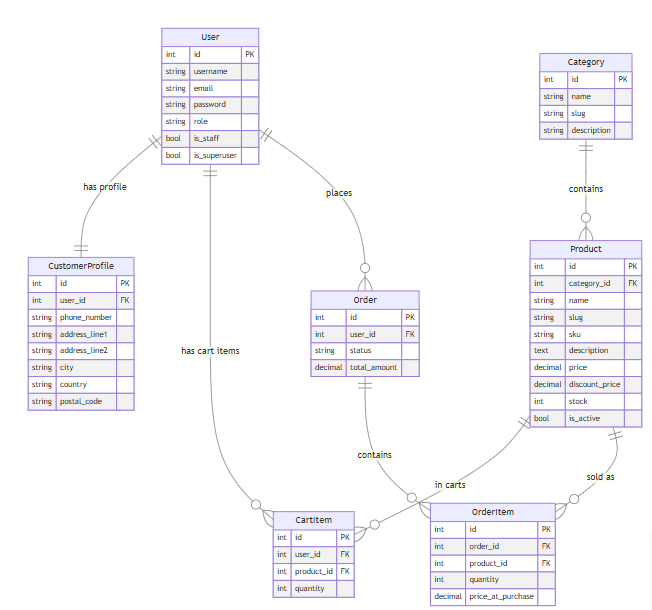

# alx-project-nexus

## **DUKA — E-Commerce Backend API**
A scalable, production-ready **Django + DRF + PostgreSQL** backend powering an e-commerce product catalog, user authentication, cart, and order system.

# **Big Picture**
Duka is an online store backend that manages:

### Users
- **Admin** – Superuser, full access  
- **Store Manager** – Can manage products/categories  
- **Customer** – Can browse, search, add to cart, checkout  

### Product Catalog
- Categories  
- Products  
- Filtering, sorting, pagination  
- Slug-based product detail endpoints  

### Cart & Checkout
- Add/remove/update cart items  
- Validate stock before checkout  
- Convert cart → order  
- Deduct stock automatically  

The system is designed for a **real frontend integration**, following REST API standards.

# ER Diagram
Main entities (models):

- accounts.User
- accounts.CustomerProfile
- store.Category
- store.Product
- store.CartItem
- store.Order
- store.OrderItem

Key relationships:
- User – CustomerProfile:
    User (1) ─── (1) CustomerProfile (one-to-one; only customers use it)
- User – CartItem:
    User (1) ─── (*) CartItem (each user can have many cart items)

- User – Order:
    User (1) ─── (*) Order (each user can place many orders)
- Category – Product:
    Category (1) ─── (*) Product
- Product – CartItem:
    Product (1) ─── (*) CartItem
- Order – OrderItem:
    Order (1) ─── (*) OrderItem
- Product – OrderItem:
    Product (1) ─── (*) OrderItem



| Legend                                        |
|----------|------------|
| PK | Primary Key (Unique Identifier)          |
| FK |Foreign Key (Reference to another table)  |
| ||--|| | One-to-One Relationship              |
| ||--o{ | One-to-Many Relationship             |

# **Technology Stack**
| Component | Technology |
|----------|------------|
| Backend Framework | Django 5 + Django REST Framework |
| Database | PostgreSQL |
| Auth | JWT (SimpleJWT) |
| API Docs | drf-spectacular (OpenAPI/Swagger) |
| Dev Tools | Miro, Postman, Django Admin |
| Seed Data | Custom management command |
| Deployment|                               |

---
---

# **Roles & Permissions**

| Role | Permissions |
|------|-------------|
| **Admin (Superuser)** | Full access (Django admin + API) |
| **Store Manager** | CRUD categories/products |
| **Customer** | View products, manage cart, checkout |
| Guest/Anonymous | Read-only product access |

The API enforces permissions using custom DRF permission classes.

---

# **Project Structure**

```
duka_app/
│
├── accounts/
│   ├── models.py
│   ├── serializers.py
│   ├── views.py
│   ├── signals.py
│   ├── apps.py
│
├── store/
│   ├── models.py
│   ├── serializers.py
│   ├── views.py
│   ├── permissions.py
│   ├── urls.py
│   ├── management/
│       └── commands/
│           └── seed.py
│
├── duka_app/
│   ├── settings.py
│   ├── urls.py
│
├── manage.py
└── README.md
```

---

# **API Endpoints Overview**

## Authentication
| Method | Endpoint |
|--------|----------|
| POST | `/api/auth/register/` |
| POST | `/api/auth/token/` |
| POST | `/api/auth/token/refresh/` |

---

## Categories
| Method | Endpoint |
|--------|----------|
| GET | `/api/categories/` |
| POST | `/api/categories/` |
| GET | `/api/categories/{id}/` |
| PUT/PATCH/DELETE | `/api/categories/{id}/` |

---

## Products
| Method | Endpoint |
|--------|----------|
| GET | `/api/products/` |
| GET | `/api/products/{slug}/` |
| POST | `/api/products/` |
| PUT/PATCH/DELETE | `/api/products/{slug}/` |

Filters:
```
/api/products/?category=3
/api/products/?ordering=price
/api/products/?search=Electronics
```

---

## Cart
| Method | Endpoint |
|--------|----------|
| GET | `/api/cart/` |
| POST | `/api/cart/` |
| GET | `/api/cart/{id}/` |
| PATCH | `/api/cart/{id}/` |
| DELETE | `/api/cart/{id}/` |

---

## Checkout
| Method | Endpoint |
|--------|----------|
| POST | `/api/checkout/` |

---

# **Seeding Dev Data**

```bash
python manage.py seed
```

Creates:
- 1 store manager  
- 5 customers  
- 5 categories  
- 50 products  

---

# **Run Locally**

```
python manage.py migrate
python manage.py seed
python manage.py runserver
```

Docs:
```
http://127.0.0.1:8000/api/docs/

```
# **Future Extensions**

- Payments (Stripe/MPesa integration)

- Wishlists

- Inventory restocking workflows

- Shipment tracking

- Store dashboard frontend